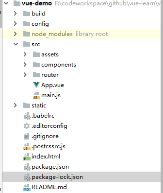

# VUE入门学习

## 环境准备

- 安装Node

  ```shell
  # 查看node版本
  node --version
  ```

- 安装npm

  ```sh
  # 查看npm版本
  npm --version
  # 查看镜像库
  npm get registry
  # 切换镜像库
  npm config set registry http://registry.npm.taobao.org/
  # 或者可以安装cnpm
  npm install -g cnpm --registry=https://registry.npm.taobao.org
  
  ```

- 安装webpack

  ```sh
  # 安装
  npm install -g webpack
  # 查看是否安装成功
  webpack -v
  
  ```

- 安装vue-cli

  ```sh
  npm install -global vue-cli
  # 查看安装的版本
  vue -V
  ```

## 初始化项目 

```sh
vue init webpack vue-demo
```


```sh
#导入IDE，推荐WebStorm 或者HBuilder
#运行项目
cd vue-demo
npm run dev
# 默认打开浏览器输入：http://localhost:8080/
```

## 项目模块简介



```sh
# /build            -->webpack使用的文件，一般不用改
# /config           -->配置文件，项目的一些配置信息
# /node_modules     --> vue项目中安装的依赖
# /src              -->源码文件夹
	# /assets          -->资源文件，一般放置静态资源
	# /components      -->自己编写的一些组件
	# /router          --> 路由信息
	# App.vue          --> app组件，包含三个部分：模板、script、样式
	# main.js          -->项目入口
# /static           -->编译好的文件会放在这个目录下
# .babelrc          -->babel编译参数，vue开发需要babel编译
# index.html 		-->主页面
# package.json 		-->项目文件，记录一些命令，和依赖
```

## 安装依赖

```sh
# 引入element-ui
npm i element-ui -S
# 观察package.json 中是否添加了依赖
  "dependencies": {
    "element-ui": "^2.9.1",
    "vue": "^2.5.2",
    "vue-router": "^3.0.1"
  },
  
```

