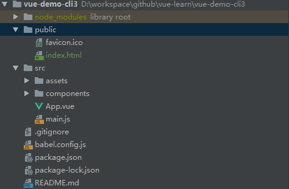

# VUE入门学习

## 环境准备

- 安装Node

  ```shell
  # 查看node版本
  node --version
  ```

- 安装npm

  ```sh
  # 查看npm版本
  npm --version
  # 查看镜像库
  npm get registry
  # 切换镜像库
  npm config set registry http://registry.npm.taobao.org/
  # 或者可以安装cnpm
  npm install -g cnpm --registry=https://registry.npm.taobao.org
  
  ```

- 安装webpack

  ```sh
  # 安装
  npm install -g webpack
  # 查看是否安装成功
  webpack -v
  
  ```

- 安装vue-cli

  ```sh
  # 安装vue-cli2
  npm install -global vue-cli
  # 查看安装的版本
  vue -V
  # 安装vue-cli3（安装2之后就不用安装3）
  npm install -g @vue/cli
  # 查看安装的版本
  vue -v
  ```

## 初始化项目 

### CLI2 初始化项目

```sh
vue init webpack vue-demo
```


```sh
#导入IDE，推荐WebStorm 或者HBuilder
#运行项目
cd vue-demo
npm run dev
# 默认打开浏览器输入：http://localhost:8080/
```

### CLI3初始化项目

```sh
# vue create <project-name> 
vue create vue-demo-cli3
#Tips: 第一次创建项目时会提醒你选择一些需要的组件，可以用默认的，也可以自定义选择
#Tips: 安装@vue/cli 之后依然可以像cli2一样初始化项目：vue init webpack vue-demo

```


初始化之后与CLI2的处理方式一样，可以直接运行，也可以导入IDE操作

## 项目模块简介

#### CLI2的项目结构


```sh
vue-demo
├──/build            -->webpack使用的文件，一般不用改
├──/config           -->配置文件，项目的一些配置信息
├──/node_modules     --> vue项目中安装的依赖
├──/src              -->源码文件夹
	├──/assets          -->资源文件，一般放置静态资源
	├──/components      -->自己编写的一些组件
	├──/router          --> 路由信息
	├──App.vue          --> app组件，包含三个部分：模板、script、样式
	├──main.js          -->项目入口
├──/static           -->编译好的文件会放在这个目录下
├──.babelrc          -->babel编译参数，vue开发需要babel编译
├──index.html 		-->主页面
├──package.json 		-->项目文件，记录一些命令，和依赖
```


#### CLI3的项目结构



```sh
vue-demo-cli3
├──/node_models			--> 依赖库
├──/public				--> 不被webpack打包，直接复制到指定目录中去
├──/src					-->源码文件
	├──/assets				-->静态资源文件
	├──/components			-->组件
	├──App.vue				-->主组件		
	├──main.js				-->入口文件
├──.gitignore			-->git过滤文件
├──bable.config.js		-->编译配置
├──package.json			-->管理项目依赖的包
├──package-lock.json	-->管理项目依赖到具体版本
├──vue.config.js		--> 可选的配置文件，如果有会被@vue/cli-service自动加载
```


## 安装依赖

```sh
# 引入element-ui
npm i element-ui -S
# 观察package.json 中是否添加了依赖
  "dependencies": {
    "element-ui": "^2.9.1",
    "vue": "^2.5.2",
    "vue-router": "^3.0.1"
  },
```

## Vue中的几个基本概念

### 组件

#### 组件是什么

> 组件是可复用的Vue实例，我们可以在一个通过new Vue 创建的Vue根实例中，把这个组件作为自定义元素来使用

```vue
// 定义一个名为 button-counter 的新组件
Vue.component('button-counter', {
  data: function () {
    return {
      count: 0
    }
  },
  template: '<button v-on:click="count++">You clicked me {{ count }} times.</button>'
})

//使用这个组件
<div id="components-demo">
  <button-counter></button-counter>
</div>
new Vue({ el: '#components-demo' })
```

因为组件是可复用的 Vue 实例，所以它们与 `new Vue` 接收相同的选项，例如 `data`、`computed`、`watch`、`methods` 以及生命周期钩子等。仅有的例外是像 `el` 这样根实例特有的选项。

**data**必须是函数，而不能是一个对象，只有这样每个实例才可以维护一份被返回对象的独立拷贝

#### 组件的组织

> 通常一个应用会以一棵嵌套的组件树的形式来组织


为了能在模板中使用，这些组件必须先注册以便 Vue 能够识别。这里有两种组件的注册类型：**全局注册**和**局部注册**。

### 路由

>**vue-router**

### 指令

> 指令是带有v- 前缀的特殊属性，指令用于在表达式的值改变时，将某些行为应用到DOM上

```html
<div id="app">
    <p v-if="seen">现在你看到我了</p>
</div>
    
<script>
new Vue({
  el: '#app',
  data: {
    seen: true
  }
})
</script>
```

### 参数

> 参数在指令后以冒号指明，例如v-bind指令被用来响应的更新HTML属性

```html
<div id="app">
    <pre><a v-bind:href="url">菜鸟教程</a></pre>
</div>
    
<script>
new Vue({
  el: '#app',
  data: {
    url: 'http://www.runoob.com'
  }
})
</script>
```

### 修饰符

> 修饰符是以半角句号 （.）指明的特殊后缀，用于指出一个指令应该以特殊方式绑定，例如，**.prevent** 修饰符告诉 **v-on** 指令对于触发的事件调用 **event.preventDefault()**：

```html
<form v-on:submit.prevent="onSubmit"></form>
```

### 过滤器

> Vue.js 允许你自定义过滤器，被用作一些常见的文本格式化。由"管道符"指示, 格式如下：

```html
<!-- 在两个大括号中 -->
{{ message | fun }}

<!-- 在 v-bind 指令中 -->
<div v-bind:id="rawId | formatId"></div>
```

过滤器函数接受表达式的值作为第一个参数。

以下实例对输入的字符串第一个字母转为大写：

```html
<div id="app">
  {{ message | capitalize }}
</div>
    
<script>
new Vue({
  el: '#app',
  data: {
    message: 'test'
  },
  filters: {
    capitalize: function (value) {
      if (!value) return ''
      value = value.toString()
      return value.charAt(0).toUpperCase() + value.slice(1)
    }
  }
})
</script>
```

过滤器是 JavaScript 函数，因此可以接受参数：

```vue
{{ message | filterA('arg1', arg2) }}
```

### 缩写

- v-bind缩写

```vue
<!-- 完整语法 -->
<a v-bind:href="url"></a>
<!-- 缩写 -->
<a :href="url"></a>
```

- v-on缩写

```vue
<!-- 完整语法 -->
<a v-on:click="doSomething"></a>
<!-- 缩写 -->
<a @click="doSomething"></a>
```

### 混入

> 混入 (mixins)定义了一部分可复用的方法或者计算属性。混入对象可以包含任意组件选项。当组件使用混入对象时，所有混入对象的选项将被混入该组件本身的选项。

### Ajax(axios)


### Vue基本语法


